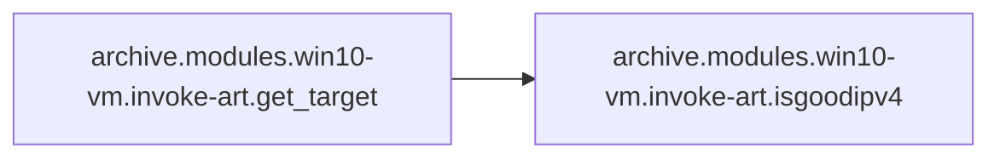

# Archive Modules

[_Documentation generated by Documatic_](https://www.documatic.com)

<!---Documatic-section-Codebase Structure-start--->
## Codebase Structure

<!---Documatic-block-system_architecture-start--->
```mermaid
None
```
<!---Documatic-block-system_architecture-end--->

# #
<!---Documatic-section-Codebase Structure-end--->

<!---Documatic-section-archive.modules.win10_vm.invoke_art.replace_atomic-start--->
## [archive.modules.win10-vm.invoke-art.replace_atomic](3-archive_modules.md#archive.modules.win10-vm.invoke-art.replace_atomic)

<!---Documatic-section-replace_atomic-start--->
<!---Documatic-block-archive.modules.win10_vm.invoke_art.replace_atomic-start--->
<details>
	<summary><code>archive.modules.win10_vm.invoke_art.replace_atomic</code> code snippet</summary>

```python
def replace_atomic(myatomic):
    fpath = './roles/art/tasks/main.yml'
    if os.path.exists(fpath):
        pass
    else:
        print('[-] Error:  File not found: ' + fpath)
        return -1
    replaced_content = ''
    file = open(fpath, 'r')
    for line in file:
        line = line.rstrip()
        new_line = ''
        if 'win_shell: powershell.exe Invoke-AtomicTest' in line:
            values = line.split()
            atomic_val = values[3]
            new_line = line.replace(atomic_val, myatomic)
            print('[+] Replaced TTP in ' + fpath)
            print('    [+] Old:  ' + atomic_val)
            print('    [+] New:  ' + myatomic)
            replaced_content += new_line + '\n'
        else:
            replaced_content += line + '\n'
    file.close()
    write_file = open(fpath, 'w')
    write_file.write(replaced_content)
    write_file.close()
    return myatomic
```
</details>
<!---Documatic-block-archive.modules.win10_vm.invoke_art.replace_atomic-end--->
<!---Documatic-section-replace_atomic-end--->

# #
<!---Documatic-section-archive.modules.win10_vm.invoke_art.replace_atomic-end--->

<!---Documatic-section-archive.modules.win10_vm.invoke_art.isgoodipv4-start--->
## [archive.modules.win10-vm.invoke-art.isgoodipv4](3-archive_modules.md#archive.modules.win10-vm.invoke-art.isgoodipv4)

<!---Documatic-section-isgoodipv4-start--->
<!---Documatic-block-archive.modules.win10_vm.invoke_art.isgoodipv4-start--->
<details>
	<summary><code>archive.modules.win10_vm.invoke_art.isgoodipv4</code> code snippet</summary>

```python
def isgoodipv4(s):
    pieces = s.split('.')
    if len(pieces) != 4:
        return False
    try:
        return all((0 <= int(p) < 256 for p in pieces))
    except ValueError:
        return False
```
</details>
<!---Documatic-block-archive.modules.win10_vm.invoke_art.isgoodipv4-end--->
<!---Documatic-section-isgoodipv4-end--->

# #
<!---Documatic-section-archive.modules.win10_vm.invoke_art.isgoodipv4-end--->

<!---Documatic-section-archive.modules.win10_vm.invoke_art.get_target-start--->
## [archive.modules.win10-vm.invoke-art.get_target](3-archive_modules.md#archive.modules.win10-vm.invoke-art.get_target)

<!---Documatic-section-get_target-start--->


### Object Calls

* [archive.modules.win10-vm.invoke-art.isgoodipv4](3-archive_modules.md#archive.modules.win10-vm.invoke-art.isgoodipv4)

<!---Documatic-block-archive.modules.win10_vm.invoke_art.get_target-start--->
<details>
	<summary><code>archive.modules.win10_vm.invoke_art.get_target</code> code snippet</summary>

```python
def get_target(hostscfg):
    fpath = hostscfg
    if os.path.exists(fpath):
        pass
    else:
        print('[-] Error:  File not found: ' + fpath)
        return -1
    file_handle = open(fpath, 'r')
    for line in file_handle:
        retval = isgoodipv4(line)
        if retval:
            myline = line.rstrip()
            return myline
    return False
```
</details>
<!---Documatic-block-archive.modules.win10_vm.invoke_art.get_target-end--->
<!---Documatic-section-get_target-end--->

# #
<!---Documatic-section-archive.modules.win10_vm.invoke_art.get_target-end--->

<!---Documatic-section-archive.modules.win10_vm.invoke_art.get_ttp-start--->
## [archive.modules.win10-vm.invoke-art.get_ttp](3-archive_modules.md#archive.modules.win10-vm.invoke-art.get_ttp)

<!---Documatic-section-get_ttp-start--->
<!---Documatic-block-archive.modules.win10_vm.invoke_art.get_ttp-start--->
<details>
	<summary><code>archive.modules.win10_vm.invoke_art.get_ttp</code> code snippet</summary>

```python
def get_ttp(myatomic):
    fpath = './art/atomic-red-team/atomics/Indexes/Indexes-CSV/windows-index.csv'
    if os.path.exists(fpath):
        pass
    else:
        print('[-] Error:  File not found: ' + fpath)
        return -1
    windex = open(fpath, 'r')
    for line in windex:
        values = line.split(',')
        atomic_string = values[1]
        if atomic_string == myatomic:
            tactic = values[0]
            technique_num = values[1]
            technique_name = values[2]
            test_name = values[4]
            mylist = [tactic, technique_num, technique_name, test_name]
            return mylist
```
</details>
<!---Documatic-block-archive.modules.win10_vm.invoke_art.get_ttp-end--->
<!---Documatic-section-get_ttp-end--->

# #
<!---Documatic-section-archive.modules.win10_vm.invoke_art.get_ttp-end--->

<!---Documatic-section-archive.modules.win10_vm.invoke_art.check_atomic_exists-start--->
## [archive.modules.win10-vm.invoke-art.check_atomic_exists](3-archive_modules.md#archive.modules.win10-vm.invoke-art.check_atomic_exists)

<!---Documatic-section-check_atomic_exists-start--->
<!---Documatic-block-archive.modules.win10_vm.invoke_art.check_atomic_exists-start--->
<details>
	<summary><code>archive.modules.win10_vm.invoke_art.check_atomic_exists</code> code snippet</summary>

```python
def check_atomic_exists(myatomic):
    fpath = './art/atomic-red-team/atomics/Indexes/Indexes-CSV/windows-index.csv'
    if os.path.exists(fpath):
        pass
    else:
        print('[-] Error:  File not found: ' + fpath)
        return -1
    windex = open(fpath, 'r')
    for line in windex:
        values = line.split(',')
        atomic_string = values[1]
        if atomic_string == myatomic:
            print('    [+] Found in windows index file')
            return True
    return False
```
</details>
<!---Documatic-block-archive.modules.win10_vm.invoke_art.check_atomic_exists-end--->
<!---Documatic-section-check_atomic_exists-end--->

# #
<!---Documatic-section-archive.modules.win10_vm.invoke_art.check_atomic_exists-end--->

[_Documentation generated by Documatic_](https://www.documatic.com)